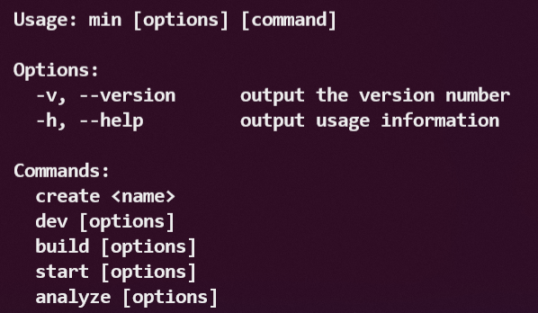
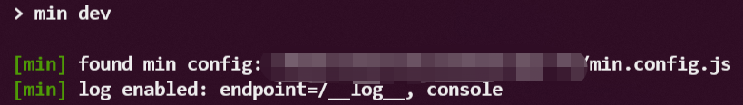

# min


A Tiny React Framework. Routing, SSR, out-of-box webpack & babel configuration, make it work, but not annoying.

### Quick Start

```bash
$ mkdir [your-project-name]
$ cd [your-project-name]
$ npm init
$ npm i -S @pickjunk/min

$ vim .babelrc # see below
$ vim routes.js # see below
$ vim Layout.tsx # see below
$ vim World.tsx # see below
$ vim Who.tsx # see below
$ vim app.js # see below
$ vim package.json # see below
```

```javascript
// .babelrc
// This file is not required but peferred.
// All dependencies showed in this example is not necessary
// to be added to your project's package.json. MIN has
// included them already, as a popular recommandation.
{
  "presets": [
    "@babel/preset-env",
    "@babel/preset-typescript",
    "@babel/preset-react"
  ],
  "plugins": [
    "@babel/plugin-transform-runtime",
    "@babel/proposal-class-properties",
    "@babel/plugin-proposal-object-rest-spread"
  ]
}
```

```javascript
// routes.js
// Define the routes tree.
export default [
  {
    path: '/',
    component: './Layout',
    children: [
      {
        component: './World',
      },
      {
        path: ':who',
        name: 'who',
        component: './Who',
      },
    ],
  },
];
```

```javascript
// Layout.tsx
// Layout Component.
import React from 'react';
import { router, Link } from '@pickjunk/min';

export default function Layout({ children }) {
  return (
    <div>
      <p>hello, {children}</p>
      <ul>
        <li>
          <Link to="/">world</Link>
        </li>
        <li>
          <Link to="/min">min</Link>
        </li>
        <li>
          <a
            href={router.link('who', { who: 'there' })}
            onClick={function(e) {
              e.preventDefault();
              router.push('who', { who: 'there' });
            }}
          >
            there
          </a>
        </li>
      </ul>
    </div>
  );
}
```

```javascript
// World.tsx
// World Component.
import React from 'react';

export default function World() {
  return <span>world</span>;
}
```

```javascript
// World.tsx
// World Component.
import React from 'react';
import { useRouter } from '@pickjunk/min';

export default function World() {
  const {
    args: { who },
    name,
    location,
  } = useRouter();

  return (
    <span>
      {who} [name: {name}] [location: {location}]
    </span>
  );
}
```

```javascript
// app.js
// App Entry.
import React from 'react';
import app from '@pickjunk/min';
import routes from './routes';

export default app({
  routes,
  render(Router) {
    return (
      <html lang="en">
        <head>
          <meta charSet="UTF-8" />
          <title>demo</title>
        </head>
        <body>
          <div id="app">
            <Router />
          </div>
        </body>
      </html>
    );
  },
  notFound() {
    alert('browser 404 alert, usually should be redirected');
  },
});
```

```javascript
// package.json
// Add dev script.
"scripts": {
  "dev": "min dev"
},
```

That's all you need. A tiny app is ready. Run:

```bash
$ npm run dev
```

Dev Server is running on port `8000` as default.

### Routes.js

Actually, the type definition of MIN's route is:

```typescript
type Route {
  path?: string;
  name?: string;
  component: string;
  children?: Route[];
}
```

It's simple. With some features you might care about:

- `path` will be concated to a complete route path without any implicit `'/'`. In other words, any `'/'` should not be ignored. You should write it explicitly in any time.

- `name` is a useful but not required property. In other react routers, it's usually considered as a feature called `Named Route` for convenient imperative navigation. More detail is below in `Imperative Router`.

- `component` path is always relative to routes.js.

- `Depth-First` is the router matching strategy.

- `Default Route (the route without path)` supported. If the matching complete in the parent of the default route, router will try to search the children of the parent. Once it check a route without `path` property, the default route is found.

### Dynamic Routes

There are two ways to define a dynamic route:

- `Short Variable`. It looks like `:var`. Convient, but not flexible. Noticed that it must end with a `'/'` or be the end of the route path. Otherwise, unexpected behavior will occur.

- `Regexp Variable`. The format is `(var:regexp)`. It's powerful but escaping consideration may be annoying. In fact, `:var` is equal to `(var:[^/]+)`.

### Router Arguments

Once you define a dynamic route, it's easy to get its arguments by `useRouter` hook.

```javascript
import React from 'react';
import { useRouter } from '@pickjunk/min';

export default function World() {
  const {
    args: { who },
  } = useRouter();

  return <span>{who}</span>;
}
```

### Imperative Router

`push`, `replace`, `forward`, `back`, `go`, `link`, six useful methods exported for imperative router actions.

```javascript
import { router } from 'react';

// navigate with history.push
router.push('name or path', { args: 'args for named routes' });

// navigate with history.replace
router.replace('name or path', { args: 'args for named routes' });

// equal to history.forward
router.forward();

// equal to history.back
router.back();

// equal to history.go
router.go(2);

// generate url to render, very useful for named routes
router.link('name or path', { args: 'args for named routes' });
```

### Custom webpack.config.js

You can custom a webpack.config.js file under your project root directory. MIN will load it and merge it with the internal webpack.config.js. A popular example is:

```javascript
// webpack.config.js
module.exports = {
  module: {
    rules: [
      {
        test: /\.(png|jpg|gif|svg)$/,
        loader: 'file-loader',
        options: {
          publicPath: path.join(__MIN_PUBLIC_PATH__, 'images'),
          outputPath: path.join(__MIN_OUTPUT_PATH__, 'images'),
        },
      },
    ],
  },
  devtool: 'cheap-eval-source-map',
  devServer: {
    proxy: [
      '/api/',
      {
        target: 'http://localhost:8080',
        changeOrigin: true,
        pathRewrite: {
          '^/api/': '/',
        },
      },
    ],
  },
};
```

> Noticed that `__MIN_PUBLIC_PATH__` and `__MIN_OUTPUT_PATH__` are two special global variables provided by MIN. They are necessary when you want to release static resources. Without them, the SSR server will not find the static resources.

### Production

It's really simple to release a MIN app.

```javascript
// package.json
// Add build & start script.
"scripts": {
  "build": "min build -p",
  "start": "min start"
},
```

```bash
$ npm run build
$ npm start
```

That's all. A production server with SSR enabled is ready on port `8000`.

> Because of the demand of SSR and dynamic routes, the production server is necessary. In other words, MIN app can not be released as pure static resources without a matching server. It might be heavier than many traditional frontend frameworks. But I think it worth.

Additionally, you might need to optimize the bundles in production. Here is the `analyze` command:

```javascript
// package.json
// Add analyze script.
"scripts": {
  "analyze": "min analyze"
},
```

```bash
$ npm run analyze
```

### Command Line Tools

More defails for `min` can be found in min's help manual.

```javascript
// package.json
// Add min script.
"scripts": {
  "help": "min"
},
```

```bash
$ npm run min
```



### Reversed Log

You might have noticed that when you run **min dev**, a logger is enabled by default:



It's MIN's "Reversed Logger" developed based on a thought that simple browser logger (console.log) is not good enough in a web app, especially in production. In most of cases, we need to collect browser logs and report them to the server finally persisting the logs.

By default, MIN enable the reversed logger and provide the basically navigating log.

To use reversed logger in your code:

```javascript
import { log } from '@pickjunk/min';

log.trace('Object or String');
log.debug('Object or String');
log.info('Object or String');
log.warn('Object or String');
log.error('Object or String');
log.fatal('Object or String');
```

To config your logger:

```javascript
// create min.config.js in your project root directory

let config = {
  log: {
    // Optional. Null by default, means console. String, means file path.
    file: process.env.NODE_ENV === 'production' ? 'log/app.log' : null,
    // Optional. '/__log__' by default.
    endpoint: '/__log__',
  },

  // disable the logger
  log: false,
};

module.exports = config;
```

### Advanced (Under the Hood)

The content from here on is not necessary to read. But if you are curious about how MIN works under the hood, topics below may be a good guide for you.

### Code Splitting

MIN provide a simple and intuitive approach to concrete code splitting. How it works can be explained in one sentence - `the component property of every Route node in routes.js will be transformed to a require.ensure loading function`.

Yes, transform, a special webpack loader do this work to `routes.js`. No need to concern about code splitting too much because this behavior is good enough in most cases.

The only thing you should notice is always naming `routes.js` as `'routes.js'`. Because the test rule of the webpack loader depend on it.

### Better Router

There are two problems with that many other react router does not do well:

- `Unintuitive reconciliation for dynamic route components`. The most popular case is defining a route like `{ path: '/post/:id', component: './Post' }`. In many other react router, the Post Component will not be unmounted and then mounted in a navigation from `/post/1` to `post/2`. It's really annoying because most people will write the data loading logic in component mounted hook and do not expect a extra prop listener for refreshing data. React Hooks (useEffect) may help you out nowadays. But honestly, it's still not intuitive.

- `Race condition in async route loading`. Once you trigger two different navigations almost in the same time, this problem can't be ignored. If the former one completed after the latter one, "rollback" shows.

To be a better router, MIN has fixed these two problems:

- `All Route Components take their path as their key prop`. For example above, `<Post key={'/post/1'} />` and `<Post key={'/post/2'} />` will be rendered. Tell react to reconcile intuitively.

- `Add switchMap operation to routing pipeline`. Thanks to rxjs, race condition is fixed so elegantly. If you isn't familar with rxjs, a [document](https://rxjs-dev.firebaseapp.com/api/operators/switchMap) and a [marble diagram](https://rxmarbles.com/#switchMap) may help you.

### SSR (Server Side Render)

Complicated topic. It contains many details about engineering but not theory.

Without doubt, MIN use `ReactDOMServer.renderToString` and `ReactDOM.hydrate`. But when facing to the problem about how to make a pretty app entry, which only export necessary interfaces but not export any annoying tech details about SSR, work become hard. You can't see `ReactDOMServer.renderToString` and `ReactDOM.hydrate` but a simple `app()` entry nowadays. MIN take all its effort to make it be.

The main code about SSR is in `bin/ssr.js`, `src/index.ts` and `src/Router.ts`. In development environment, situations in `bin/dev.js` is more complicated. Thanks to the `serverSideRender` option of `webpack-dev-middleware`, work should have been harder without it.

Besides, like other SSR supported frameworks, MIN also support the `initialProps` feature:

```javascript
import React from 'react';
import { initialProps } from '@pickjunk/min/Router';

export default initialProps(function({ path, args, name }) {
  return new Promise(function(resolve) {
    setTimeout(function() {
      resolve({ path, args, name });
    }, 2000);
  });
})(function One({ path, args, name }) {
  return (
    <>
      <h4>This is one</h4>
      <h4>
        path:{path} args:{JSON.stringify(args)} name:{name}
      </h4>
    </>
  );
});
```

`initialProps` not only run in browser but also in SSR server. Make sure the code in it is `isomorphic`. Fetching data in `initialProps` and return a Promise result, a "pure" SSR app is born.

> initialProps is a powerful feature. But it require isomorphic code which usually makes things complicated. "Pure" SSR app is not necessary in most cases. So it's not recommanded.
